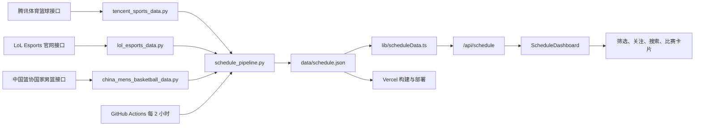
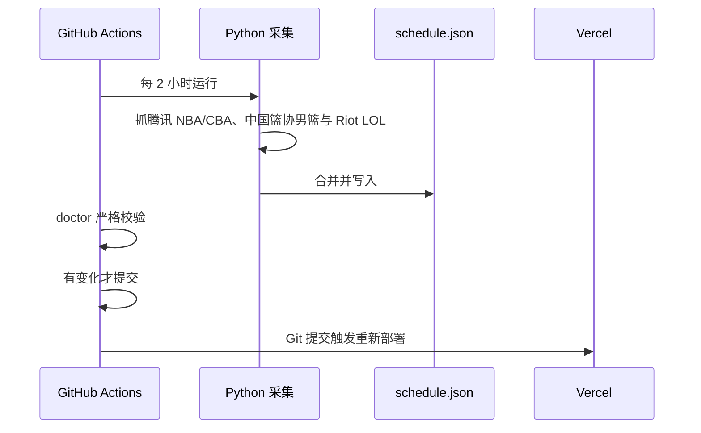

# 项目技术路线与函数学习手册

本文按“数据从哪里来 → 如何变成统一格式 → API 如何提供 → 页面如何筛选和展示 → 如何自动运营”的顺序解释整个项目。适合把本项目当作网站开发与运营练习。

## 1. 整体数据路线



这条路线分为四层：

1. **采集层**：Python 从腾讯体育和 Riot Games 官网接口读取原始数据；
2. **统一层**：不同来源被转换成相同的 `MatchData`；
3. **服务层**：Next.js Route Handler 读取 JSON 并返回站内 API；
4. **界面层**：React 在浏览器内完成筛选、搜索、关注和展示。

网站访问者不会直接调用腾讯或 Riot 接口，只访问你部署的网站。外部接口失败时，采集脚本可以使用上一次生成的来源缓存，并在页面上标记降级。

## 2. 目录职责

| 路径 | 主要职责 |
| --- | --- |
| `app/` | Next.js 页面、布局、PWA 清单和 Route Handler |
| `components/` | 页面可复用组件和交互界面 |
| `context/` | React 全局关注状态与扫描线设置 |
| `lib/` | 类型、联赛判断、时间筛选、服务端数据读取 |
| `scripts/` | 腾讯 NBA/CBA、中国篮协男篮、Riot LOL 采集、合并、诊断脚本 |
| `data/schedule.json` | 网站实际读取的统一比赛数据 |
| `data/cache/` | 本机来源级后备缓存，不提交 Git |
| `.github/workflows/` | 定时采集和自动提交 |
| `docs/` | 学习、使用和部署说明 |
| `public/` | PWA 图标与不缓存业务数据的 Service Worker |

## 3. 统一数据模型

文件：`lib/types.ts`

项目最关键的设计是：页面不理解腾讯或 Riot 的原始字段，只理解自己的统一类型。

### 3.1 主要类型

| 类型 | 用途 |
| --- | --- |
| `BasketballLeague` | `NBA / CBA / TEAM_CHINA` |
| `LolLeague` | `LOL_LPL / LOL_LCK / LOL_INTL` |
| `League` | 所有支持的篮球和 LOL 联赛 |
| `LeagueFilter` | 顶部 `LOL / NBA / CBA / 国家队` 栏目 |
| `MatchStatus` | `UPCOMING / LIVE / FINISHED` 三种统一状态 |
| `Team` | 统一球队或战队字段，以及关注分组 `group` |
| `MatchData` | 时间、状态、双方、比分、来源、视频入口 |
| `DataSourceStatus` | 数据源名称、状态、更新时间和降级原因 |
| `ScheduleResponse` | `/api/schedule` 返回的完整结构 |

### 3.2 为什么 LOL 不直接叫 `LPL` 和 `LCK`

页面顶部的 `LOL` 是一个栏目，但数据内部仍要区分：

- `LOL_LPL`：用于显示 LPL 标签和生成 LPL 关注列表；
- `LOL_LCK`：用于显示 LCK 标签和生成 LCK 关注列表；
- `LOL_INTL`：用于 MSI、Worlds、First Stand 等国际赛事。

这样既能让用户只点一次 `LOL`，又能在卡片和关注栏中保留赛事归属。

## 4. 腾讯体育篮球采集

文件：`scripts/tencent_sports_data.py`

### 4.1 入口和配置

| 名称 | 用途 |
| --- | --- |
| `MATCHWEB_BASE` | 腾讯体育比赛接口主机 |
| `COLUMN_LEAGUE` | 腾讯栏目 ID 到 NBA、CBA 的映射 |
| `HISTORY_DAYS / FUTURE_DAYS` | 控制抓取历史与未来时间窗口 |
| `NBA_EAST_TEAM_NAMES` | 识别 NBA 东部 15 支正式球队 |
| `NBA_WEST_TEAM_NAMES` | 识别 NBA 西部 15 支正式球队 |
| `ACQUISITION_STATE` | 记录每个栏目是实时、缓存还是不可用 |

### 4.2 函数索引

| 函数 | 输入 → 输出 | 主要用途 |
| --- | --- | --- |
| `utc_now()` | 无 → UTC ISO 时间 | 给缓存和采集状态生成可比较时间 |
| `slugify(value)` | 名称 → 稳定字符串 | 生成可作为 ID 的文本 |
| `_fetch_matches(column_id, start, end)` | 腾讯栏目和日期 → 原始比赛数组 | 请求 `matchUnion/list` 并拍平按日期分组的响应 |
| `_parse_datetime(raw)` | 腾讯北京时间字符串 → 带 `+08:00` 的 ISO 时间 | 防止部署到不同时区后时间错位 |
| `_normalize_status(match_period)` | 腾讯状态码 → 统一比赛状态 | `0` 未开始、`1` 直播、其他结束 |
| `_parse_score(raw)` | 字符串比分 → 数字或空 | 防止非法比分进入页面 |
| `_team_group(league, team_name)` | 联赛、队名 → 关注分组 | 把 NBA 正式球队分到东西部，表演队放入 `NBA_OTHER` |
| `_normalize_team(...)` | 腾讯球队字段 → `Team` | 建立稳定 ID、名称、颜色和关注分组 |
| `_adapt_match(raw, league)` | 一条腾讯比赛 → `MatchData` | 映射时间、状态、双方、比分和来源链接 |
| `fetch_league_data(league)` | 联赛 → 比赛数组 | 尝试实时接口，失败时读取来源级缓存 |
| `_write_cache(league, matches)` | 联赛比赛 → 缓存文件 | 保存本次成功采集，供下次降级使用 |
| `_load_cache(league)` | 联赛 → 缓存比赛和时间 | 实时接口失败时读取最近成功版本 |
| `get_nba_data()` | 无 → NBA 比赛 | NBA 专用兼容入口 |
| `get_cba_data()` | 无 → CBA 比赛 | CBA 专用兼容入口 |
| `get_all_data()` | 无 → 篮球聚合结果 | 顺序采集 NBA、CBA 两个腾讯栏目并汇总错误与状态 |

### 4.3 数据准确性规则

- 比赛 ID 优先使用腾讯 `mid`，避免同一场比赛重复；
- 未开始的比赛强制清空比分，避免显示假的 `0-0`；
- 没有双方队名、双方相同或明显不是比赛的条目会被丢弃；
- NBA 表演队、全明星临时队不会被放入正式东西部关注列表；
- 腾讯采集器不再读取国家队栏目，避免混入女篮、青年队或不完整的聚合数据。

## 5. 中国篮协官网男篮采集

文件：`scripts/china_mens_basketball_data.py`

国家队数据只来自中国篮球协会官网国家男篮页面。脚本先读取国家男篮赛事列表，再读取每项赛事的“赛程赛果”接口，最终只得到包含中国男篮的单场比赛。

| 函数 | 输入 → 输出 | 主要用途 |
| --- | --- | --- |
| `_request_json(url, params)` | 官网接口与参数 → JSON | 统一请求中国篮协官网，强制按 UTF-8 解码中文 |
| `_event_inside_window(event)` | 赛事摘要 → 布尔值 | 只处理最近 180 天和未来 180 天的男篮赛事 |
| `_parse_match_time(date, time)` | 官网日期时间 → `+08:00` ISO 时间 | 保证中国标准时间准确 |
| `_normalize_status(value)` | 官网状态码 → 统一状态 | `0` 未开始、`1` 直播、其他结束 |
| `_normalize_team(...)` | 官网球队字段 → `Team` | 生成国家队栏目稳定球队 ID |
| `_source_url(event)` | 赛事摘要 → 官网“赛程赛果”链接 | 让用户可回到中国篮协原始页面核对 |
| `_adapt_game(raw, event)` | 官网单场记录 → `MatchData` | 映射对阵、比分、场地、阶段和来源 |
| `fetch_china_men_data()` | 无 → 中国男篮比赛 | 读取男篮赛事列表及每项赛事的单场赛程，失败时使用缓存 |
| `get_all_data()` | 无 → 男篮结果与采集状态 | 输出 `CHINA_MEN_OFFICIAL` 状态供合并管线使用 |

官网列表的筛选入口固定为国家男篮 `teamId=1`，返回的正式队伍 ID 当前为 `848`。女篮、三人篮球、国青和国少具有不同入口，本脚本不会请求它们。

## 6. Riot LOL 官网采集

文件：`scripts/lol_esports_data.py`

数据来自 LoL Esports 官网自身使用的 `getSchedule` 接口。默认使用网站公开调用所需的 API key，也可以通过 `LOLESPORTS_API_KEY` 环境变量替换。

### 5.1 赛事配置

`LOL_SOURCES` 当前包含：

- `LOL_LPL`：LPL；
- `LOL_LCK`：LCK；
- `LOL_WORLDS`：全球总决赛；
- `LOL_MSI`：季中冠军赛；
- `LOL_FIRST_STAND`：First Stand 国际赛。

LPL、LCK 保存为各自联赛；三个国际来源统一转换成 `LOL_INTL`，具体赛事名仍保留在比赛的 `venue` 字段中。

### 5.2 函数索引

| 函数 | 输入 → 输出 | 主要用途 |
| --- | --- | --- |
| `_fetch_events(league_id)` | Riot 联赛 ID → 官网事件数组 | 请求 LoL Esports 官方赛程接口 |
| `_normalize_status(state)` | `unstarted/inProgress/completed` → 统一状态 | 让 LOL 和篮球共用卡片组件 |
| `_normalize_team(raw, group, index)` | Riot 战队字段 → `Team` | 用战队 code 生成跨赛事稳定 ID |
| `_score(team, status)` | 战队结果 → 小局胜场 | 未开赛返回空，直播/结束返回系列赛比分 |
| `_adapt_event(event, source)` | 官网事件 → `MatchData` | 写入 LPL/LCK/国际赛、BO3/BO5 和官网入口 |
| `_inside_window(match)` | 比赛 → 布尔值 | 保留最近 180 天和未来 180 天，防止 JSON 无限增长 |
| `_cache_path(source_key)` | 来源键 → 缓存路径 | 为每个 LOL 赛事单独管理后备缓存 |
| `_write_cache(...)` | 来源比赛 → 缓存文件 | 保存官网本次成功结果 |
| `_load_cache(...)` | 来源 → 缓存比赛和时间 | 官网连接失败时降级 |
| `fetch_source(source_key)` | 单一赛事 → 比赛数组 | 完成请求、标准化、时间过滤、去重、缓存 |
| `get_all_data()` | 无 → LOL 聚合结果 | 汇总 LPL、LCK 和国际赛事及采集状态 |

### 5.3 国际赛事为何可能暂时为空

官网只会在具体对阵公布后返回比赛。新一届 Worlds 只有日期、但没有对阵时，`LOL_WORLDS` 可以采集成功却返回 0 条当前时间窗口内的比赛。这是“官网尚未发布”，不是程序故障。之后定时任务会自动抓到新对阵。

## 7. 合并与生成统一 JSON

文件：`scripts/schedule_pipeline.py`

| 函数 | 主要用途 |
| --- | --- |
| `build_schedule(use_cache=True)` | 调用腾讯 NBA/CBA、中国篮协男篮与 Riot LOL 三套采集器，按比赛 ID 去重并合并结果 |
| `write_schedule_json(output_file=None)` | 把最终对象写入 `data/schedule.json` |

兼容入口 `scripts/scrape_cba_schedule.py` 的 `main()` 负责调用 `write_schedule_json()`，所以原有 npm 命令无需改变：

```bash
npm run scrape:schedules
```

最终 JSON 的核心结构：

```json
{
  "generatedAt": "ISO 时间",
  "matches": [],
  "acquisition": {
    "NBA": { "mode": "live", "updatedAt": "..." },
    "CHINA_MEN_OFFICIAL": { "mode": "live", "updatedAt": "..." },
    "LOL_LPL": { "mode": "live", "updatedAt": "..." }
  },
  "errors": []
}
```

`mode` 的含义：

- `live`：本次直接从外部接口取得；
- `cache`：本次联网失败，使用上一次成功文件；
- `unavailable`：实时和后备缓存都没有可用数据。

## 8. Next.js 服务端数据层

文件：`lib/scheduleData.ts`

此文件导入 `server-only`，保证文件读取逻辑不会误打包进浏览器。

| 函数 | 主要用途 |
| --- | --- |
| `validTimestamp(value)` | 验证并转换 ISO 时间 |
| `sanitizeAndDedupe(matches)` | 丢弃非法时间、过期伪直播和重复比赛，优先保留有比分版本 |
| `buildSourceStatus(...)` | 根据每个来源的采集时间和模式生成绿色/黄色来源状态 |
| `readScheduleCache()` | 读取 `data/schedule.json`，生成腾讯、中国篮协、LoL Esports 三张来源卡片 |
| `buildResponse(...)` | 组成统一 `ScheduleResponse`，并计算 `isStale` |
| `getNbaSchedule()` | 只返回腾讯缓存里的 NBA 比赛，用于 `/api/nba` |
| `getCombinedSchedule()` | 返回篮球和 LOL 的全部比赛，用于首页和健康检查 |

重要变化：这里没有 NBA 官方 CDN 请求。`/api/nba` 和首页 NBA 栏目都只使用腾讯体育采集结果。

## 9. Route Handler

### `app/api/schedule/route.ts`

`GET()` 调用 `getCombinedSchedule()`，返回首页需要的统一数据。响应设置服务器/CDN 共享缓存，减少重复文件处理；浏览器端仍使用 `no-store`，不会持久积累每次赛程响应。

### `app/api/nba/route.ts`

`GET()` 调用 `getNbaSchedule()`，提供只含腾讯 NBA 的兼容接口。

### `app/api/health/route.ts`

`GET()` 调用 `getCombinedSchedule()`，统计总数、未开始、直播、已结束数量：

- 有数据且来源正常：`ok`；
- 有数据但部分来源降级：`degraded`；
- 完全无数据：`unavailable`，HTTP `503`。

运营时可以让监控服务访问 `/api/health`。

## 10. 页面主流程

文件：`components/ScheduleDashboard.tsx`

### 9.1 关键状态

| 状态 | 作用 |
| --- | --- |
| `leagueFilter` | 当前 LOL、NBA、CBA 或国家队栏目，默认 LOL |
| `scheduleScope` | 近日、后续赛程、最近赛果 |
| `searchQuery` | 搜索词 |
| `matches` | 当前页面内存中的唯一一份比赛数组 |
| `sources` | 数据来源状态 |
| `initialLoading` | 首次加载骨架状态 |
| `refreshing` | 后台或手动刷新状态，不清空旧页面 |
| `refreshInFlight` | 防止多个请求重叠 |

### 9.2 关键函数与计算

| 名称 | 主要用途 |
| --- | --- |
| `formatUpdatedAt(value)` | 把来源时间转成中文月日时分 |
| `loadSchedule(initial)` | 15 秒超时请求 `/api/schedule`，替换当前数组并更新来源状态 |
| `leagueMatches` | 调用 `matchBelongsToFilter()` 生成当前栏目数据 |
| `visibleSources` | LOL 显示 Riot，NBA/CBA 显示腾讯，国家队显示中国篮协来源 |
| `searchedMatches` | 搜索双方名称、简称和 `venue` 中的赛事阶段 |
| `windowedMatches` | 调用 `filterMatchesByScope()` 限制时间范围与数量 |
| `favoriteMatches / normalMatches` | 把关注比赛置顶，其余比赛保持普通顺序 |

`useEffect()` 首次加载数据，并注册三种刷新条件：

1. 页面可见时每 60 秒检查；
2. 网络从离线恢复时检查；
3. 用户重新切回标签页时检查。

组件卸载时会清除定时器和事件监听器。

## 11. 栏目与时间筛选

### `lib/league.ts`

| 函数 | 主要用途 |
| --- | --- |
| `isLolLeague(league)` | 判断一场比赛是否属于 LPL、LCK 或国际 LOL |
| `matchBelongsToFilter(match, filter)` | `LOL` 一次匹配三个 LOL 内部联赛；篮球按联赛精确匹配 |

### `lib/filterMatches.ts`

`filterMatchesByScope(matches, scope, now)`：

- `UPCOMING`：直播和未开始，按时间升序，最多 60 条；
- `RESULTS`：已结束，按时间倒序，最多 60 条；
- `NEARBY`：过去 14 天到未来 21 天，最多 60 条。

限制条数既改善首屏性能，也避免一次创建几百张 React 卡片。

## 12. 分组关注功能

### `context/FavoritesContext.tsx`

`FavoritesProvider` 管理全站关注状态。

| 函数 | 主要用途 |
| --- | --- |
| `toggleFavoriteTeam(teamId)` | 增加或取消球队/战队关注 |
| `toggleFavoritePlayer(playerId)` | 保留已有球员关注能力 |
| `isFavoriteTeam(teamId)` | 比赛卡片判断星标状态 |
| `isFavoritePlayer(playerId)` | 球员行判断关注状态 |
| `setScanlinesEnabled(enabled)` | 保存 CRT 扫描线开关 |
| `useFavorites()` | 子组件读取关注上下文 |

### `components/FavoriteBar.tsx`

| 函数/计算 | 主要用途 |
| --- | --- |
| `groupForTeam(match, team)` | 把 LPL、LCK、NBA 东西部、CBA、国家队放入正确分组 |
| `matchesSelectedPicker(match, selected)` | 只为当前栏目生成可关注列表 |
| `teamsByGroup` | 去重、排序并生成分组按钮 |
| `favoriteTeams` | 显示当前栏目已经关注的对象 |
| `otherGroups` | 在折叠选择器中显示未关注对象 |

LOL 国际赛战队不单独建“国际”关注组。用户从 LPL 或 LCK 分组关注后，因为战队 ID 根据 code 稳定生成，同一战队参加国际赛时仍会自动置顶。

### `components/MatchCard.tsx`

- 显示篮球或 LOL 联赛标签；
- LOL 系列赛比分使用小局胜场；
- 两侧星标直接调用 `toggleFavoriteTeam()`；
- 展开后提供赛事官网、视频和图片入口；
- `STATUS_CONFIG` 统一未开始、直播、已结束样式；
- `LEAGUE_LABELS / LEAGUE_COLORS` 控制各赛事标签和颜色。

## 13. 直播入口

文件：`components/WatchLinks.tsx`

`WATCH_LINKS` 是两个外部入口配置：

- `https://live.bilibili.com/lol`：哔哩哔哩英雄联盟直播；
- `https://sports.qq.com/kbsweb/`：腾讯体育篮球直播。

`WatchLinks()` 遍历配置生成 `<a target="_blank">`。项目只跳转，不抓取、不代理、不缓存直播视频。

## 14. 侧栏与状态组件

### `components/PortalSidebar.tsx`

| 函数/计算 | 主要用途 |
| --- | --- |
| `formatDate()` | 来源更新时间与比赛时间 |
| `formatCoverageDate()` | 数据最早/最晚覆盖日期 |
| `sourceStatus()` | 把 fresh/stale/unavailable 转成中文和颜色 |
| `favoriteTeamMatches` | 当前栏目关注球队或战队最近比赛 |
| `visibleFavoriteTeamCount` | 只统计当前栏目真正出现的关注对象 |

`entityLabel` 决定侧栏显示“球队”还是“战队”。

### `components/AppStatusControls.tsx`

负责在线/离线提示、PWA 安装按钮和 Service Worker 注册。它不保存赛程快照。

## 15. 浏览器缓存控制

项目按“实时读取、看完丢弃”实现：

1. `ScheduleDashboard` 的 `fetch()` 使用 `cache: "no-store"`；
2. 赛程只存在 React `matches` 状态中，刷新时替换旧数组；
3. 页面关闭后，浏览器可回收该内存；
4. `public/sw.js` 没有 `fetch` 监听与 `caches.open()`；
5. Service Worker 激活时会删除旧版 `cyberpunk-hoops-*` Cache Storage；
6. `localStorage` 只存小体积关注 ID 和显示设置。

服务端最多 5 分钟共享缓存是为了减少服务器重复工作，不会把历史赛程堆在访客设备中。

## 16. 自动运营路线

文件：`.github/workflows/refresh-schedule.yml`



工作流主要步骤：

1. `actions/checkout` 拉取仓库；
2. 安装 Python 3.11 与依赖；
3. 执行 `scripts/scrape_cba_schedule.py`；
4. 执行 `node scripts/doctor.mjs --strict`；
5. 只有 `data/schedule.json` 改变时才提交和推送；
6. Vercel 监听默认分支并重新部署。

## 17. 数据诊断

文件：`scripts/doctor.mjs`

脚本检查：

- Node.js 版本与必要文件；
- 六种内部联赛是否合法；
- 比赛 ID、时间、状态和双方字段；
- 重复 ID、未开始比赛数量和缓存年龄；
- 腾讯两类、中国男篮一类与 Riot 五类采集状态是否齐全；
- 按联赛输出数据分布。

`npm run doctor` 适合日常观察，`npm run check:data` 适合发布阻断校验。

## 18. 推荐学习顺序

1. 阅读 `lib/types.ts`，理解统一数据模型；
2. 用浏览器打开 `/api/schedule`，对照 `MatchData`；
3. 阅读三套采集器的 `_adapt_*`，比较腾讯、中国篮协与 Riot 字段；
4. 阅读 `schedule_pipeline.py`，理解两类来源如何合并；
5. 阅读 `lib/scheduleData.ts`，理解服务端如何读取与标记来源；
6. 阅读 `ScheduleDashboard.tsx`，学习请求、状态、派生数据和生命周期；
7. 阅读 `FavoriteBar.tsx`，学习分组、去重与 `useMemo`；
8. 修改一个组件样式并运行 `npm run lint`；
9. 修改一个字段映射，重新抓取并执行 `npm run check:data`；
10. 通过 GitHub Actions 和 Vercel 观察自动更新链路。

## 19. 排错顺序

### 页面没有比赛

1. 访问 `/api/health`；
2. 运行 `npm run doctor`；
3. 查看 `data/schedule.json` 中对应联赛数量；
4. 查看 `acquisition` 是 `live`、`cache` 还是 `unavailable`；
5. 手动运行 `npm run scrape:schedules`；
6. 查看 GitHub Actions 日志和 Vercel 最新部署。

### NBA 东西部没有球队

1. 检查腾讯队名是否变化；
2. 对照 `_team_group()` 的正式队名集合；
3. 重新生成 `data/schedule.json`；
4. 运行 `npm run check:data`。

### LOL 没有国际赛

1. 在 LoL Esports 官网确认是否已公布具体对阵；
2. 查看 `LOL_WORLDS / LOL_MSI / LOL_FIRST_STAND` 采集状态；
3. 若来源为 `live` 但比赛为 0，通常表示当前时间窗口内官网尚无对阵；
4. 若来源为 `unavailable`，检查网络、公开 API key 或接口字段。

### 本地网址打不开

1. 确认运行了 `npm run dev`；
2. 等待终端显示 `Ready`；
3. 访问 `http://localhost:3000`；
4. 检查端口是否被占用、防火墙是否拦截；
5. 不要关闭启动服务的终端。
