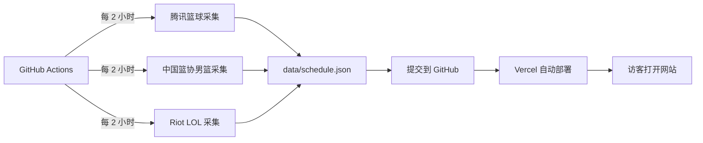

# 使用、部署与运营指南

本文回答四个问题：如何把项目当网站使用、如何当 App 使用、如何让它长期在线、运行需要什么电脑和网络。

## 1. 直接使用已部署网站

打开：[https://codextest-blond.vercel.app](https://codextest-blond.vercel.app)

页面栏目：

- `LOL`：LPL、LCK、MSI、First Stand、Worlds 已公布赛程；
- `NBA`：腾讯体育 NBA 赛程；
- `CBA`：腾讯体育 CBA 赛程；
- `国家队`：只显示中国篮球协会官网发布的中国男篮单场比赛。

LOL 关注选择器分为 LPL 和 LCK；NBA 关注选择器分为东部和西部；CBA 在自己的栏目中单独选择。

直播按钮只负责跳转：

- [哔哩哔哩英雄联盟直播](https://live.bilibili.com/lol)；
- [腾讯体育篮球直播](https://sports.qq.com/kbsweb/)。

项目不抓取、不代理、不缓存直播视频。能否观看、是否需要登录或会员，由目标平台和赛事版权决定。

## 2. 在本机学习和开发

### 2.1 安装条件

- Windows、macOS 或 Linux；
- Node.js `18.18.0` 或更高；
- Python 3.11 或更高；
- 建议至少 4 GB 可用内存和 1 GB 可用磁盘空间；
- 安装依赖与抓取数据时需要联网。

### 2.2 第一次运行

```bash
npm install
python -m pip install -r requirements.txt
npm run scrape:schedules
npm run dev
```

终端显示 `Ready` 后访问：

```text
http://localhost:3000
```

`localhost` 只代表当前电脑。只有开发服务器正在运行时才能访问；关闭终端、电脑休眠、重启或断电后都会停止。

### 2.3 日常修改流程

```bash
npm run doctor
npm run dev
# 修改代码后
npm run check
```

需要最新赛程时运行：

```bash
npm run scrape:schedules
```

该命令会访问腾讯体育与 LoL Esports 官网，并替换 `data/schedule.json`。不会在浏览器中保存历史版本。

## 3. 页面使用方法

1. 在顶部切换 `LOL / NBA / CBA / 国家队`；
2. 展开“选择关注战队/球队”；
3. LOL 从 LPL、LCK 分组选择；NBA 从东西部分组选择；
4. 关注后，涉及该队的比赛会在当前栏目置顶；
5. 使用“近日”查看过去 14 天到未来 21 天；
6. 使用“后续赛程”查看直播中与未开始比赛；
7. 使用“最近赛果”查看最近结束的比赛；
8. 搜索队名、简称、场馆、周次、淘汰赛或 BO3/BO5；
9. 展开比赛卡片查看官方来源和视频入口；
10. 在侧栏检查来源状态、更新时间和数据覆盖范围。

绿色“已连接”表示最近一次采集正常。黄色“降级可用”表示某个栏目为空、实时接口失败后用了缓存，或文件超过 36 小时未更新。

## 4. 作为 App 使用

这是 PWA，共用网站代码和部署，不需要另外维护一套手机 App。

### Windows、macOS、Android

1. 用 Chrome 或 Edge 打开生产网站；
2. 点击页面右上角“安装 APP”，或使用浏览器菜单“安装应用”；
3. 安装后从桌面或应用列表启动。

### iPhone、iPad

1. 用 Safari 打开生产网站；
2. 点击“分享”；
3. 选择“添加到主屏幕”。

### App 限制

- 必须联网；
- 不保留离线赛程；
- 不是 App Store/应用商店原生应用；
- 没有推送通知、后台同步、APK 或 IPA；
- 清理浏览器数据会同时删除本机关注设置。

## 5. 数据是怎样更新的



两种更新时间不要混淆：

- 页面每 60 秒重新读取你的网站 API；
- 外部赛程默认每 2 小时由 GitHub Actions 重新抓取。

因此页面刷新并不代表每分钟重新访问腾讯和 Riot。这样可以减少接口压力与部署成本，但不提供秒级比分。

## 6. 推荐部署：GitHub + Vercel

### 6.1 部署步骤

1. 本机运行 `npm run scrape:schedules`；
2. 本机运行 `npm run check`；
3. 把代码和 `data/schedule.json` 提交到 GitHub；
4. 在 Vercel 导入 GitHub 仓库；
5. Framework Preset 选择 Next.js；
6. 构建命令使用 `npm run build`；
7. 部署完成后访问 Vercel HTTPS 域名；
8. 在 GitHub Actions 手动运行一次 `Auto-refresh schedule data`；
9. 确认 Actions 具有 `contents: write` 权限；
10. 确认 Action 的新提交能触发 Vercel 自动部署。

### 6.2 电脑是否必须一直开机

使用 Vercel + GitHub Actions 后，你的个人电脑不需要开机：

- Vercel 负责网站在线；
- GitHub Actions 负责定时抓取；
- GitHub 仓库保存最近一次统一数据。

个人电脑只在学习、修改代码、手动抓取或重新部署时使用。

### 6.3 当前生产站点

- 固定网址：[https://codextest-blond.vercel.app](https://codextest-blond.vercel.app)
- Vercel 项目：`codextest`

注意：本机部署命令可以把当前工作区快照直接发布到 Vercel，但 GitHub Actions 只有在代码已经提交并推送到 GitHub 默认分支后才会按新逻辑自动更新。只部署、不推送 GitHub，网站能打开，但自动抓取仍可能运行旧版本。

## 7. 其他部署方式

### Netlify

仓库包含 `netlify.toml` 和 Next.js 插件。连接 GitHub 后部署，但仍需验证 Node.js Route Handler、文件打包、定时数据更新和外部网络访问。

### VPS 或自己的电脑

```bash
npm ci
python -m pip install -r requirements.txt
npm run scrape:schedules
npm run build
npm run start
```

这种方式要求：

- 电脑或服务器持续开机；
- Node.js 进程持续运行；
- 使用任务计划、cron 或其他方式定时执行抓取；
- 设置进程守护，异常退出后自动重启；
- 公网访问需要域名、HTTPS、防火墙、端口或反向代理；
- 做好系统更新、安全补丁和备份。

不建议缺少安全经验时把家庭电脑端口直接暴露到公网。

## 8. 网络环境要求

### 开发电脑

需要访问：

- npm 软件源；
- Python 软件源；
- `matchweb.sports.qq.com`；
- `www.cba.net.cn`；
- `esports-api.lolesports.com`；
- 如果使用 GitHub/Vercel，还需要访问对应平台。

### GitHub Actions

需要能访问腾讯体育、中国篮协官网和 LoL Esports 接口，并拥有向仓库写入 `data/schedule.json` 的权限。

### 普通访客

普通访问只需要连接你的 Vercel 域名。点击直播或来源外链时，才需要访问哔哩哔哩、腾讯体育或 LoL Esports。

### 地区与代理问题

- 某些海外云平台可能不稳定访问腾讯体育；
- 某些公司网络可能拦截 Riot、GitHub 或 Vercel；
- 腾讯、Riot 可能更改接口、限流或验证策略；
- 外部直播平台可能根据地区、账号、会员和版权限制观看。

采集失败时先查看 `data/schedule.json` 的 `acquisition`，再查看 GitHub Actions 日志。

## 9. 设备缓存与内存

项目不会把每次赛程不断追加到设备：

- 接口请求明确使用浏览器 `no-store`；
- 当前页面只保存一份 `matches` 数组；
- 新响应到达后替换旧数组；
- 关闭页面后由浏览器回收内存；
- Service Worker 不缓存接口、HTML 或赛程；
- 旧版本业务 Cache Storage 会在激活时删除；
- 只有关注 ID 和扫描线开关保存在 `localStorage`，通常为几 KB。

浏览器仍可能缓存 JS、字体、图标等普通静态文件，这是正常的性能优化，大小有限，也不会按每场比赛持续增长。

服务器侧的 5 分钟共享缓存不占用访客设备空间。

## 10. 运营检查清单

### 每次发布前

```bash
npm run scrape:schedules
npm run check
```

确认：

- LOL、NBA、CBA 栏目有合理数量；
- 国家队只包含中国男篮，且每场均有中国男篮作为一方；
- LPL/LCK 战队分组正确；
- NBA 东西部各为 15 支正式球队；
- 两个直播入口可打开正确平台；
- 手机宽度没有横向滚动；
- `/api/health` 返回 200 或可解释的 `degraded`。

### 每周

- 查看 GitHub Actions 最近运行是否成功；
- 查看 Vercel 部署是否由最新提交触发；
- 检查数据源更新时间；
- 抽查数场比赛与官网/腾讯页面是否一致；
- 检查外链是否重定向或失效。

### 每月

- 更新 npm 与 Python 依赖；
- 查看第三方接口字段是否变化；
- 检查 Git 历史和 Vercel 部署次数；
- 评估是否需要数据库、分析、错误追踪或告警。

## 11. 常见问题

| 现象 | 常见原因 | 处理方法 |
| --- | --- | --- |
| `localhost:3000` 打不开 | 开发服务器没运行或终端已关闭 | 运行 `npm run dev` 并等待 `Ready` |
| NBA/CBA 不更新 | 腾讯接口失败或 Action 没运行 | 手动抓取并查看 `acquisition` 与 Actions 日志 |
| 国家队为空 | 中国篮协男篮官网当前时间窗口没有单场记录，或接口异常 | 检查 `CHINA_MEN_OFFICIAL` 状态和官网男篮赛事页 |
| LOL 国际赛为空 | 官网尚未发布具体对阵 | 到 LoL Esports 官网确认，等待定时任务 |
| LOL 来源 unavailable | Riot 接口、公开 key 或网络异常 | 手动抓取，检查接口和代理环境 |
| 关注列表缺队 | 来源队名/code 改变或当前时间窗口无该队比赛 | 检查生成数据与分组映射 |
| 页面显示旧数据 | GitHub 未推送、Action 失败或 Vercel 未重新部署 | 检查提交、Action、部署三段链路 |
| PWA 安装按钮不出现 | 使用 HTTP 开发模式或浏览器不支持 | 使用 HTTPS 生产网址和 Chrome/Edge/Safari |
| 直播打不开 | 平台地区、账号、版权或网络限制 | 直接检查目标平台，不是本项目缓存问题 |

## 12. 当前不足与扩展方向

### 数据方面

- 依赖腾讯与 Riot 的非承诺长期稳定接口；
- 默认两小时更新，不是实时计分器；
- 国家队只覆盖中国篮协官网国家男篮页已发布的单场比赛；
- 国际赛事只有官网公布对阵后才出现；
- 没有完整阵容、技术统计和官方排名。

### 产品方面

- 没有用户账号和跨设备同步；
- 没有消息推送和赛前提醒；
- 没有后台管理、内容审核和用户反馈；
- 没有访问分析、错误追踪和自动告警；
- 不是原生 App，不能直接提交应用商店。

### 技术与成本方面

- GitHub Actions 持续提交 JSON 会增长仓库历史；
- 每次数据提交可能触发一次 Vercel 构建；
- 高流量时需要数据库、对象存储、限流、日志和费用监控；
- 来源级缓存位于采集环境，不是分布式数据服务。

### 合规方面

- 项目只提供数据来源与跳转入口，不保存或转播视频；
- 公开商业运营前，应确认赛事数据、队名、商标、直播链接和平台条款；
- 若接入广告、登录或用户分析，还需补充隐私政策、Cookie 说明和账号安全。

## 13. 推荐的下一阶段

1. 先稳定运行 GitHub Actions + Vercel；
2. 加入 Sentry 或其他错误追踪；
3. 加入隐私友好的访问分析；
4. 把 `schedule.json` 迁移到数据库或对象存储；
5. 增加账号与跨设备关注同步；
6. 增加赛前提醒，但仍避免持久缓存完整赛程；
7. 建立管理员数据源状态页和告警。
